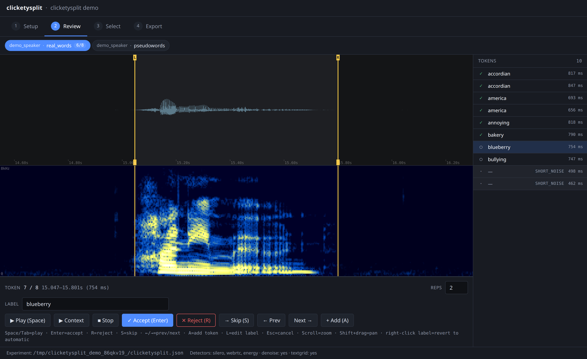
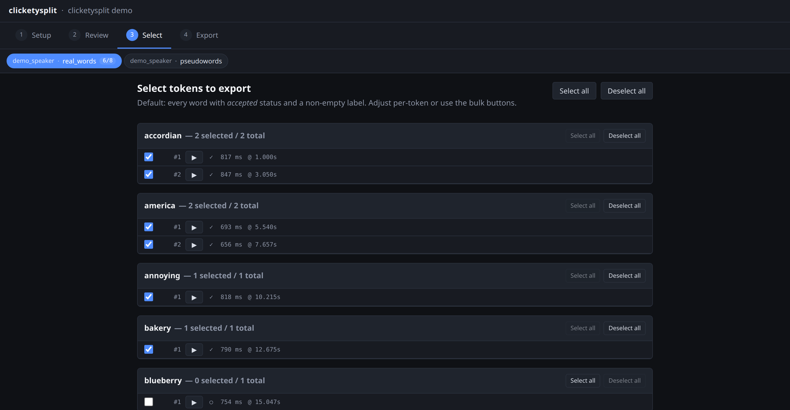
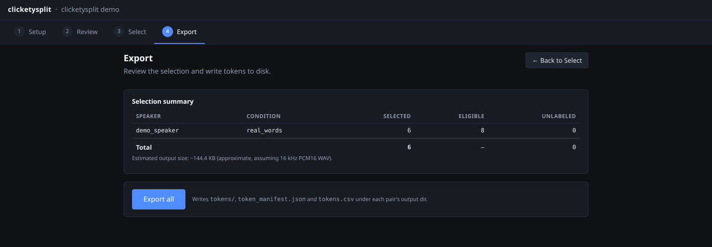

# clicketysplit

[](https://www.python.org/downloads/)
[](LICENSE)

A browser-based segmentation tool for speech recordings of single-word or
pseudoword stimuli.

You give it a stimulus list (real words, pseudowords, whatever your study
needs) and a recording. It proposes word boundaries, auto-labels each token
from the stimulus list, and gives you a keyboard-driven review UI with
fuzzy-match autocomplete for quick corrections. The output is a folder of
cleanly-sliced WAV tokens plus a manifest — optionally a Praat TextGrid so
the source recording stays usable in Praat.



## Why this exists

This replaces the Praat-based workflow used in many labs for a specific kind
of session: single-word tokens read in sequence, which may or may not be real
words. That workflow means hand-placing every boundary and typing every
filename. For a 60-word list at 2 repetitions each, that's 120 slices per
speaker per condition, by hand.

- **Stimulus-list aware.** You declare what the speaker was supposed to say.
  Autocomplete and auto-labeling work just as well on *pseudowords* as on
  real words — there's no dictionary or forced aligner assuming English
  lexical items, and nothing to transcribe.
- **Fast labeling.** The tool knows the presentation order (massed
  `aaa bbb ccc`, spaced `abc abc abc`, or random) and how many repetitions to
  expect, so it prefills the label it expects next. When the speaker skips
  ahead, adds an extra repetition, or fumbles a take, the prediction adapts
  instead of dragging every later label out of alignment.
- **Praat-compatible, but you only touch Praat if you want to.** Optional
  TextGrid export keeps the source recording useful for follow-up acoustic
  analysis. The fast path — propose → review → export — never opens Praat.
- **Browser UI, local backend.** It's a Python package: `pip install`, run
  `clicketysplit serve`, and the segmenter opens in your browser. No Electron,
  no cloud, no audio leaves your machine.

## Install

```bash
pip install clicketysplit          # core: Silero VAD, WAV/FLAC/OGG
pip install 'clicketysplit[all]'   # + webrtcvad, denoise, MP3, Praat TextGrid
```

Requires Python 3.10+. Optional system dependency: `ffmpeg` (only for MP3/M4A
input).

## Try it

```bash
clicketysplit demo
```

This boots a throwaway two-condition experiment against bundled audio — one
clip of real words, one of pseudowords — so you can walk the whole flow
without setting anything up.

## Using it on your own recordings

```bash
clicketysplit serve
```

Point the setup wizard at a folder of recordings laid out by speaker and
condition:

```
recordings/
├── f1/
│   ├── real_words/session.wav
│   └── pseudowords/session.wav
└── f2/
    └── ...
stimulus_lists/
├── real_words.txt
└── pseudowords.txt
```

The wizard discovers speakers and conditions, matches each condition to a
stimulus list by name, and lets you set detection parameters. Then:

**Review** — one token at a time, entirely from the keyboard:

| Key | Action |
|---|---|
| `Space` / `Tab` | play the token |
| `Enter` | accept the label |
| `R` | reject (not a token) |
| `S` | skip |
| `←` / `→` | previous / next |
| `A` | add a token the detector missed |
| `L` | edit the label |
| scroll / shift+drag | zoom / pan the waveform |

To adjust a slice, click anywhere on the waveform or the spectrogram to move
the nearest boundary there, or drag a boundary handle if you want to see it
move. Both views are interactive and stay in sync.

**Select** — pick which repetitions of each word to keep.



**Export** — write the tokens out.



Each speaker × condition gets a `tokens/` directory of WAVs, a
`token_manifest.json`, and a `tokens.csv`. Sessions autosave and survive a
restart or a move of the experiment folder — paths in the config are
relative.

## How it works

1. **Detect.** Silero voice-activity detection proposes speech regions, with
   optional background-noise reduction first. (webrtcvad is available as an
   alternative via the `[webrtc]` extra.)
2. **Refine.** Each boundary is snapped to the nearest energy-envelope
   crossing, so slices start and end on the actual acoustic edge rather than
   the VAD frame grid.
3. **Classify.** Segments are typed by duration: too short is noise, too long
   is crosstalk, the rest are words. The crosstalk cutoff adapts to the
   recording's own median word length, so a slow speaker's ordinary words
   don't get thrown out.
4. **Label.** For massed recordings, word tokens are clustered on the pauses
   between them — speakers pause briefly between repetitions of a word and
   longer when moving to the next one — and each cluster takes the next
   stimulus in the list.
5. **Review and export.** You correct what the detector got wrong, choose the
   takes you want, and export.

## Provenance

The detection engine is a port of a tool I wrote and used to cut the stimuli
for a word learning experiment — recording each word and pseudoword several
times, then slicing out the individual tokens to use as experimental items.
The port is verified against the original's output on those recordings:
identical segment counts and 0.0 ms boundary differences. The labeling
behavior — how the predicted label reacts when a speaker skips ahead, adds a
repetition, or produces a token you reject — is ported from the same tool,
having been shaped by actually using it for hours.

The bundled demo audio is my own voice, cut from those recordings.

## Development

```bash
pip install -e '.[dev,all]'
pytest                       # Python tests
cd frontend && npm ci && npm run test && npm run build
```

The Python and TypeScript labeling implementations share
`tests/labeling_test_vectors.json`; both suites replay it so the two can't
drift.

## License

MIT — see [LICENSE](LICENSE).
